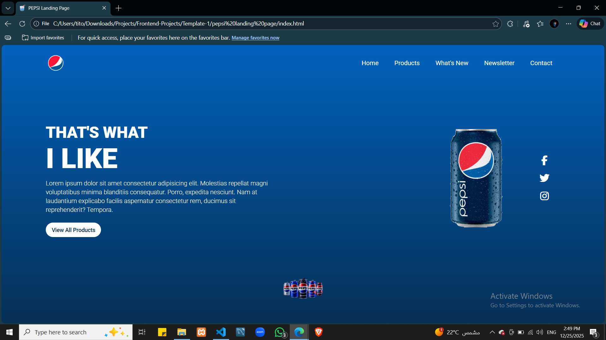
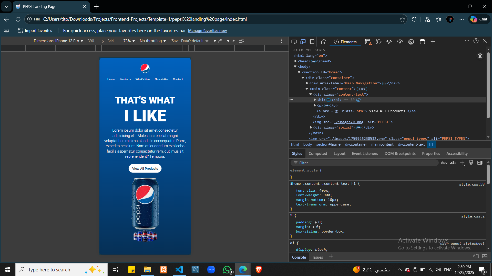

# Pepsi-Landing-Page

A responsive landing page inspired by the Pepsi brand, built using pure HTML and CSS.  
The project focuses on layout structure, responsive design, and clean UI presentation.

## Features
- Responsive layout for desktop, tablet, and mobile
- Modern landing page design
- CSS animations for visual enhancement
- Clean and simple UI structure

## Tech Stack
- HTML5
- CSS3
- Font Awesome
- Google Fonts (Roboto)

## Screenshots
| Desktop | Mobile |
|  |  |

## Notes
This project was built as a frontend practice to improve layout, responsiveness, and styling skills.
